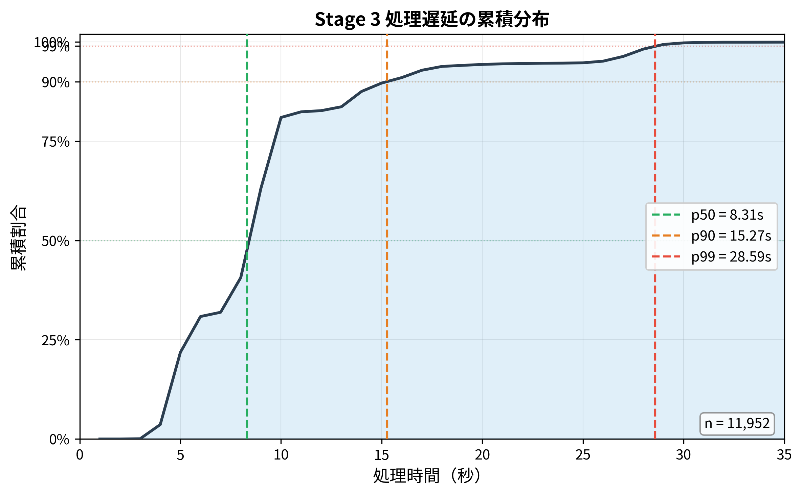
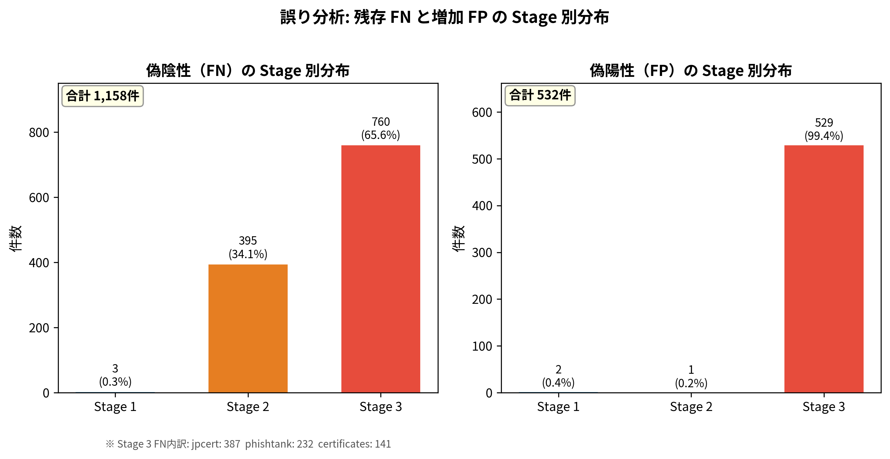
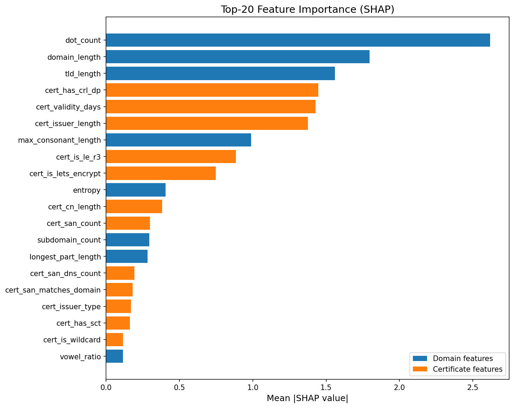
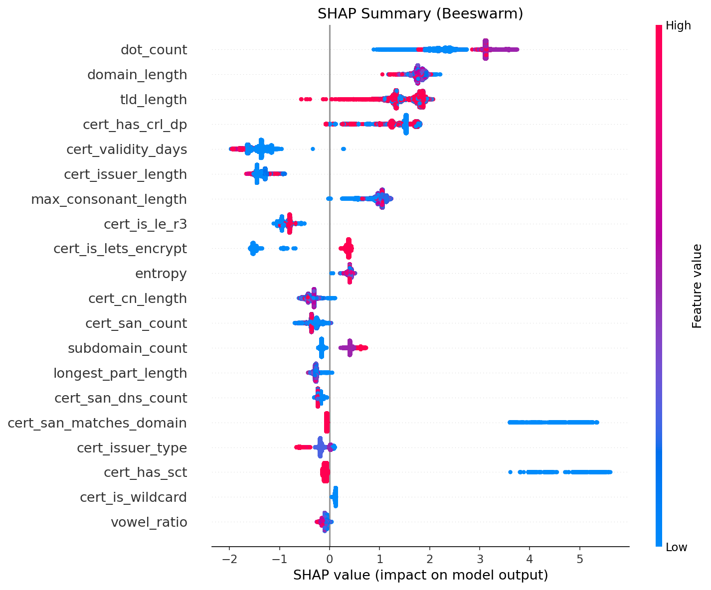

# RAPIDS 研究進捗報告書

**報告日**: 2026年2月
**前回打ち合わせ**: 2025年12月25日

---

## 1. 本報告の位置づけ

2025年12月25日の打ち合わせで合意した「確信度駆動の二層連携設計」に基づき、システムの実装と評価を行った。本報告では、前回の決定事項・アクションアイテムそれぞれへの対応結果を報告し、今後の方針についてご相談したい。

---

## 2. 決定事項への対応

### 2.1 決定①: グレー判定を許容する設計

**前回の議論の結果**: 第1層で0/1に無理に押し込むのではなく、確信度が低いサンプルを「グレー（判定保留）」とし、第2層に渡す。モデルはXGBoostに固執しない。

> 森先生「確信度が高くないやつ、グレーはグレーにしてほしい。確信を持ってノーマルと答えた、確信を持ってフィッシングと答えた、それぞれあると思うんですけど、それ以外の中間のやつは保留。」

**対応**: XGBoostの出力確率に2つの閾値（t_high=0.957, t_low=0.001）を設定し、三値ルーティングを実装した。

| 判定 | 条件 | 件数 | 割合 |
|------|------|------|------|
| auto_phishing（確信あり: フィッシング） | p₁ ≥ 0.957 | 60,767 | 47.8% |
| auto_benign（確信あり: 正規） | p₁ ≤ 0.001 | 8,464 | 6.7% |
| handoff（グレー → 後段へ） | 0.001 < p₁ < 0.957 | 57,991 | 45.6% |

閾値はτスイープ（τ=0.0〜1.0、51点）により決定。τ=0.3〜0.5で自動判定誤り396〜427件（変動±7.5%）と安定域を確認した。

「XGBoostに固執しない」との合意に基づき、LightGBM・RandomForestとも比較した（Stage1+2のみ、Stage3なしの条件）:

| モデル | 主要パラメータ | F1 | Precision | Recall | FPR |
|--------|-------------|-----|-----------|--------|-----|
| XGBoost | depth=8, lr=0.1, n=300 | 98.60% | 99.48% | 97.73% | 0.51% |
| LightGBM-A | leaves=31, depth=8, n=500 | 98.65% | 99.52% | 97.80% | 0.47% |
| LightGBM-B | leaves=63, depth=12, n=800 | 98.66% | 99.53% | 97.81% | 0.47% |
| RandomForest-A | trees=500, depth=∞ | 98.58% | 99.31% | 97.85% | 0.68% |
| RandomForest-B | trees=500, depth=20 | 98.63% | 99.56% | 97.71% | 0.43% |

5モデル間のF1差は最大0.08pt。LightGBM-BがF1最高（98.66%）だが、差はごく小さい。本評価ではXGBoostで構築済みのパイプラインを使用した。Stage1をLightGBM-Bに差し替えた場合のシステム全体への影響は未検証であり、必要に応じて追試可能。

**補足: 三値分類について**

前回の打ち合わせでは「三値分類（0=悪性, 1=正常, 2=グレー）」も選択肢として挙がった。今回は二値分類＋閾値運用で三値ルーティングを実現する方式を採り、システム全体でF1 98.67%を達成できたため、三値ラベルでの学習は実施していない。

---

### 2.2 決定②: 高確信度誤判定の特定・分析

**前回の議論の結果**: 「自信を持って間違える」ケース（高確信度のFP/FN）を特定し、特徴分析によりチューニングして削減する。

> 森先生「0とか1っていうのは確信度が高いものなんですけど、その確信度が高いやつは絶対に合っててほしいんですね。」

**対応**: SHAP TreeExplainerで全127,222件の特徴量重要度を分析し、高確信度誤判定を抽出した。

#### 高確信度誤判定の結果

| 種別 | 件数 | 主な原因 |
|------|------|---------|
| Auto-phishing FP（p₁≥0.957, y=0） | 4件 | dot_count, domain_lengthが強くphishing方向に押し、cert特徴量の補正を上回った |
| Auto-benign FN（p₁≤0.001, y=1） | 2件 | cert_validity_days, cert_is_lets_encryptが強くbenign方向。**正規に見える証明書を持つフィッシング**が原因 |

高確信度誤判定は合計**6件**（127,222件中 0.005%）。閾値設計が適切に機能していることを確認した。

#### Stage2による二重チェック

さらに、Stage2で証明書ゲート（cert gate）+ LR誤り確率推定を追加し、自動判定の信頼性を補強した。自動判定（115,270件）中の誤りは401件（0.348%）に抑制。

#### 特徴量重要度の全体像

- Top-3: dot_count, domain_length, tld_length（ドメイン構造特徴量）
- 4位以降: cert_has_crl_dp, cert_validity_days, cert_issuer_length（証明書メタ特徴量）
- Top-20内訳: ドメイン特徴量8個、証明書特徴量12個
- Gray zoneでは cert_is_lets_encrypt の重要度が全体比 **1.32倍** に上昇
  - Let's Encrypt証明書がフィッシング/正規の判別を困難にしている主因を示唆

詳細は付録Cを参照。

---

### 2.3 決定③: 実分布（正規多数）での検証

**前回の議論の結果**: バランスデータだけでなく、実分布（正規多数、フィッシング少数）でも評価し、精度の変化を確認する。

> 森先生「バランスデータではなく、実分布（例：正規8割、フィッシング2割）で評価した場合、精度は下がる可能性があるため、そこも試すべき」

**対応**: TPR/FPRは入力分布に依存しない（prior shift仮定）ため、ベイズ式で異なるクラス比率でのPrecisionを推定した。

$$PPV(p) = \frac{TPR \cdot p}{TPR \cdot p + FPR \cdot (1-p)}$$

| 正規:フィッシング | Precision | Recall | F1 |
|---|---|---|---|
| 1:1（本評価） | 99.16% | 98.18% | 98.67% |
| 5:1 | 95.91% | 98.18% | 97.03% |
| 10:1 | 92.15% | 98.18% | 95.07% |
| 20:1 | 85.44% | 98.18% | 91.37% |
| 100:1（CTログ想定） | 54.00% | 98.18% | 69.68% |

#### 運用成立条件の逆算

(a) **必要ベースレート**: Precision≥90%には実効比率 ≤ 13:1 が必要（p ≥ 0.071）

(b) **必要FPR**: 所与のベースレートで目標Precisionを達成するためのFPR上限

$$FPR \leq \frac{TPR \cdot p \cdot (1-PPV^{\ast})}{PPV^{\ast} \cdot (1-p)}$$

| ベースレート p | 正規:フィッシング | PPV≥90%に必要なFPR |
|---|---|---|
| 0.01 | 100:1 | ≤ 0.110% |
| 0.001 | 1000:1 | ≤ 0.0109% |

本システムのFPR=0.84%はバランス評価では十分低いが、CTログ規模（100:1〜1000:1）では必要水準に対して1桁以上不足する。**これは本システム固有の弱点ではなく、FPRが有限である任意の検知器に共通する数学的制約**（base-rate fallacy）。候補生成フィルタで実効比率を引き上げることが運用条件となる。

> 注: prior shift仮定であり、CTログの正規ドメイン分布がテストセットと異なる場合（covariate shift）はFPR自体が変わりうる。実環境データでの追検証が今後の課題。

---

### 2.4 決定④: 第2層入力を「確信度不足のグレー」に限定

**前回の議論の結果**: 第2層（エージェント）への入力は、確信度不足のグレー判定に限定する運用を目指す。

> 森先生「確信度を持てないのを第二層に渡したいということだと思いますので、確信度を持てないというのは確率が0とか1ではない、真ん中のやつですと。」

**対応**: Stage2（LR + 証明書ゲート）を新設し、Stage1のhandoff 57,991件からさらに絞り込みを行った。

| 処理段階 | 件数 | 割合 |
|----------|------|------|
| Stage1 handoff（グレー） | 57,991 | 45.6% |
| Stage2 drop_to_auto（安全と判定、自動判定に戻す） | 46,039 | 36.2% |
| **Stage3投入（最終的な「確信不足」）** | **11,952** | **9.4%** |

Stage3（LLMエージェント + 26ルールモジュール）での結果:

| 構成 | Precision | Recall | F1 |
|------|-----------|--------|-----|
| LLMのみ | 87.69% | 55.34% | 67.85% |
| **LLM+ルール** | 76.11% | **68.92%** | **72.33%** |
| 差分 | -11.58pt | **+13.58pt** | +4.48pt |

- 811件（6.79%）がルールにより判定変更（flip）
- `risk_factors` + `rules_fired` により監査可能な根拠と再現性を付与

---

## 3. システム全体の結果

### 3.1 アーキテクチャ

```
[証明書データ: 127,222件テスト]
     ↓
┌─────────────────────────────────────────────────────┐
│ Stage1: XGBoost（三値ルーティング）                    │
│  42特徴量、t_high=0.957, t_low=0.001                  │
│  → auto_phishing: 60,767件（47.8%）                  │
│  → auto_benign:    8,464件（ 6.7%）                  │
│  → handoff:       57,991件（45.6%）→ Stage2          │
└─────────────────────────────────────────────────────┘
     ↓
┌─────────────────────────────────────────────────────┐
│ Stage2: LR誤り確率推定 + 証明書ハードゲート            │
│  cert gate: +12,992件safe化 / override: 1,718件強制投入 │
│  → drop_to_auto: 46,039件（36.2%）                   │
│  → Stage3投入:   11,952件（ 9.4%）                   │
└─────────────────────────────────────────────────────┘
     ↓
┌─────────────────────────────────────────────────────┐
│ Stage3: LLMエージェント + ドメイン知識ルール            │
│  Qwen3-4B-Thinking GPTQ-Int8 + 26ルールモジュール      │
│  → TP: 1,685 / FP: 529 / TN: 8,978 / FN: 760       │
└─────────────────────────────────────────────────────┘
```

### 3.2 全体性能

#### 混同行列（127,222件）

|  | 予測: Phishing | 予測: Benign |
|---|---:|---:|
| **実際: Phishing** | TP = 62,453 | FN = 1,158 |
| **実際: Benign** | FP = 532 | TN = 63,079 |

- **FP 532件**: 正規ドメインをフィッシングと誤判定。主にドメイン構造がフィッシングに類似するケース
- **FN 1,158件**: フィッシングを見逃し。Stage1での高確信度FNは6件のみ（§2.2）、大半はStage3で救済しきれなかったグレーゾーン

#### 性能指標

| 指標 | 値 | 備考 |
|------|-----|------|
| **Precision** | **99.16%** | アラートの信頼性 |
| **Recall** | **98.18%** | フィッシングの捕捉率 |
| **F1** | **98.67%** | |
| FPR | 0.84% | 正規ドメインの誤検知率 |
| FNR | 1.82% | フィッシングの見逃し率 |
| 自動判定率 | 90.6% | Stage1+2で確定（LLM不要） |
| Stage3投入率 | 9.4% | LLMエージェントが処理 |

### 3.3 Stage1+2のみとの比較

| 指標 | Stage1+2のみ | 全段 | 変化 |
|------|-------------|------|------|
| **F1** | 98.60% | **98.67%** | **+0.07pt** |
| **Recall** | 97.73% | **98.18%** | **+0.45pt** |
| FNR | 2.27% | 1.82% | -0.45pt |
| FPR | 0.51% | 0.84% | +0.33pt |
| FN件数 | 1,444 | **1,158** | **-286件** |

---

## 4. 論文構成案

### 4.1 構成（8ページ目安）

**論文タイトル案**: 「3段カスケード型フィッシング検出における投入制御とルール統合の効果分析」

| セクション | ページ | 主な内容 | 状態 |
|----------|-------|---------|------|
| §1 はじめに | 0.8 | RQ2本 + 知見3本 | outline完了 |
| §2 関連研究 | 1.0 | | outline完了 |
| §3 手法 | 1.4 | 設計原則 + 擬似コード | outline完了 |
| §4 評価実験 | 3.1 | RQ1, RQ2 | outline完了、データ整合済 |
| §5 議論 | 1.4 | 下記参照 | outline完了 |
| §6 まとめ | 0.3 | | outline完了 |

#### 論文§5（議論）で扱う予定の論点

- **投入制御のトレードオフ**: Stage3追加でFNR -0.45pt改善 / FPR +0.33pt増加のバランス
- **クラス不均衡下の性能**: prior shift analysisの結果と運用成立条件（§2.3の内容）
- **主な制約事項**: 証明書保有率の非対称性、concept drift、FN不可観測性（実運用ではFNに気づけない）
- **今後の課題**: 特徴量拡張（DNS/WHOIS等）、2段階検証フロー、継続的傾向分析

### 4.2 図表（計13点）

#### 図（5点）

| 番号 | プレビュー | 内容 |
|------|----------|------|
| 図1 |  | 3段カスケードアーキテクチャ |
| 図2 |  | Stage遷移の件数推移 |
| 図3 |  | 閾値スイープ（call rate vs auto-decision errors） |
| 図4 |  | Stage3処理遅延CDF |
| 図5 |  | 誤り分析（FN/FP Stage別分布） |

#### 表（8点 + 付録1点）

| 番号 | 内容 | 検証 |
|------|------|------|
| 表1 | データセット構築内訳 | ✅ |
| 表2 | 証明書可用性・ステータス分布 | ✅ |
| 表3 | システム全体性能（ヘッドライン） | ✅ |
| 表4 | Stage2投入制御効果 | ✅ |
| 表5 | Stage3性能（difficult subset） | ✅ |
| 表6 | Stage3アブレーション | ✅ |
| 表7 | Threats to Validity要約 | ✅ |
| 表8 | クラス比率別性能推定 | ✅ |
| 付録表A | Stage1分類器ベースライン比較 | ✅ |

### 4.3 データ整合性

- `python scripts/generate_paper_data.py --verify` ✅ パス
- `python scripts/generate_paper_figures.py --verify` ✅ パス
- `docs/paper/number_source_map.md` で全主要数値の出典を追跡可能

---

## 5. ご相談事項

1. **論文化の可否**: 本成果を論文としてまとめてよいか
2. **投稿先**: 論文化する場合、どの会議・ジャーナルを想定すべきか
3. **追加実験の要否**: 現状の評価で十分か、補足すべき実験があるか

### 論文化が承認された場合の作業予定

| タスク | 優先度 | 状態 |
|--------|-------|------|
| LaTeX原稿作成・図表流し込み | P0 | 未着手 |
| 提出前整合性ゲート | P0 | 未着手 |
| Abstract | P1 | 未着手 |
| 関連研究の差分強化 | P1 | 未着手 |
| Ethics/Data availability | P1 | 未着手 |

---

## 付録

### A. 参考資料

| 資料 | パス |
|-----|------|
| 論文アウトライン | `docs/paper/paper_outline.md` |
| 数値出典対応表 | `docs/paper/number_source_map.md` |
| 図ファイル対応表 | `docs/paper/images/FIGURE_MAP.md` |
| スタイルガイド | `docs/paper/STYLE_GUIDE.md` |
| 前回打ち合わせ記録 | `docs/mtg/202512/20251228.txt` |
| base-rate数学解説 | `docs/reports/base_rate_math_explanation.md` |
| base-rateメモ(LaTeX) | `docs/reports/base_rate_sensitivity_memo.tex` |
| SHAP分析レポート | `docs/reports/shap_analysis_report.md` |
| SHAP重要度図 | `docs/paper/images/shap_global_importance.png` |
| SHAP Beeswarm図 | `docs/paper/images/shap_beeswarm.png` |

### B. 用語集

| 用語 | 定義 |
|-----|------|
| Auto-decision（自動判定） | Stage1/Stage2が後段に送らず確定した判定 |
| Handoff（投入） | 当該Stageで判定を確定せず後段へ送ること |
| Gray zone（低確信度領域） | Stage1出力確率がt_low < p₁ < t_highの領域 |
| Difficult subset（困難集合） | Stage1・Stage2で自動判定されずStage3に到達した集合（n=11,952） |
| Call rate（投入率） | テスト全体に対するStage3投入件数の割合（9.4%） |
| Auto-decision error | 自動判定された集合における誤分類（401件、0.348%） |
| Prior shift | クラス比率（事前確率）のみが変化し、特徴量分布は不変という仮定 |
| Base-rate fallacy | 低頻度イベントの検知でFPRが小さくてもFPが大量に出る現象 |

### C. SHAP特徴量重要度分析（決定②対応）

Stage1 XGBoost（42特徴量）のSHAP TreeExplainerによる特徴量重要度分析。テスト全127,222件で計算。

#### Top-10 特徴量

| 順位 | 特徴量 | 種別 | Mean abs(SHAP) |
|------|--------|------|----------------|
| 1 | dot_count | Domain | 2.617 |
| 2 | domain_length | Domain | 1.797 |
| 3 | tld_length | Domain | 1.559 |
| 4 | cert_has_crl_dp | Cert | 1.448 |
| 5 | cert_validity_days | Cert | 1.427 |
| 6 | cert_issuer_length | Cert | 1.376 |
| 7 | max_consonant_length | Domain | 0.989 |
| 8 | cert_is_le_r3 | Cert | 0.884 |
| 9 | cert_is_lets_encrypt | Cert | 0.748 |
| 10 | entropy | Domain | 0.404 |

Top-20内訳: ドメイン特徴量8個、証明書特徴量12個。上位3つはドメイン構造特徴量が占め、4位以降は証明書メタ特徴量が交互に並ぶ。

#### 高確信度誤判定の分析

| 種別 | 件数 | 特徴 |
|------|------|------|
| Auto-phishing FP（p₁≥0.957, y=0） | 4件 | dot_count, domain_length が強くphishing方向に押し、cert特徴量のbenign方向補正を上回った |
| Auto-benign FN（p₁≤0.001, y=1） | 2件 | cert_validity_days, cert_is_lets_encrypt, cert_issuer_length が強くbenign方向。**正規に見える証明書を持つフィッシング**が原因 |

高確信度誤判定は合計6件（127,222件中 0.005%）であり、閾値設計（t_high=0.957, t_low=0.001）が適切に機能していることを示す。

#### Gray zone の特徴

Gray zone（handoff領域）では cert_is_lets_encrypt の重要度が全体比 **1.32倍** に上昇。Let's Encrypt証明書がフィッシング/正規の判別を困難にしている主因であることを示唆する。





詳細: [`docs/reports/shap_analysis_report.md`](shap_analysis_report.md)
